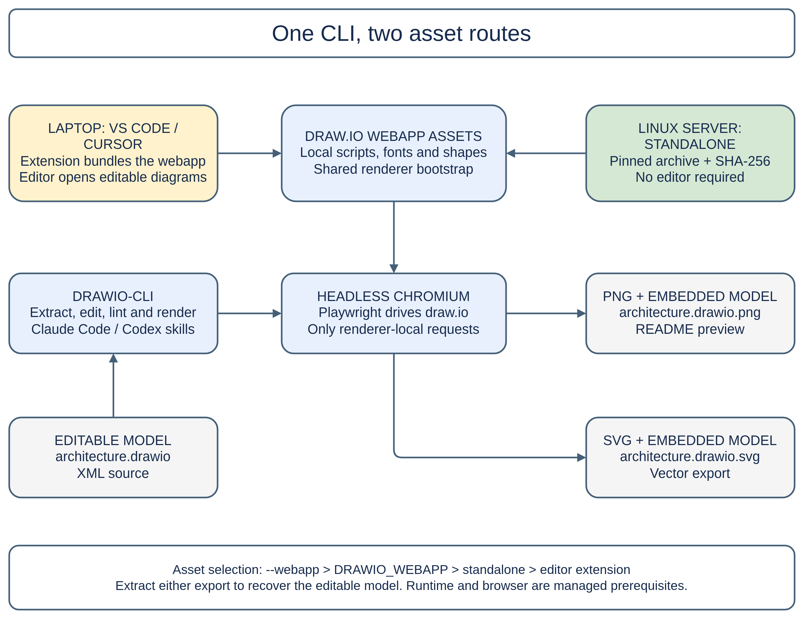

# draw-io-cli

Extract, edit and render draw.io diagrams from the command line, with Claude Code
and Codex integration. Rendering runs local draw.io webapp assets in headless
Chromium. Assets can come from a standalone installation or an installed
[hediet.vscode-drawio](https://marketplace.visualstudio.com/items?itemName=hediet.vscode-drawio)
extension for VS Code or Cursor. After installation, rendering works offline.



[Editable architecture source](docs/architecture.drawio) · [SVG export](docs/architecture.drawio.svg)

## Install

Run these commands from the checkout root. Node >= 20, a Playwright-compatible
Chromium executable and its OS libraries are prerequisites. On a managed Linux
server, the administrator supplies the runtime and browser, including
`PLAYWRIGHT_BROWSERS_PATH` when the browser is in a managed location. The standalone
asset installer also requires `unzip`. It does not install browsers or OS packages.

```
npm ci --ignore-scripts --cache .task-evidence/npm-cache
node src/cli.js install-assets
node src/cli.js doctor
node src/cli.js render docs/architecture.drawio --png --svg
```

The CLI dependencies, npm cache and webapp assets remain in this checkout.
`doctor` checks assets, the Playwright package and the browser executable's
presence. The render command actually launches the browser and exports a diagram.
Report missing managed prerequisites to the administrator with the failing output.

For a laptop with the editor extension already installed, omit `install-assets`
to use extension discovery. The editor remains separate from the headless CLI.
The Linux extension-asset route is tested, but an interactive laptop/editor
session has not been validated.

For an optional project-local command link, run once from the checkout root:

```
mkdir -p .task-evidence/cli-prefix/bin
ln -s ../../../src/cli.js .task-evidence/cli-prefix/bin/drawio-cli
.task-evidence/cli-prefix/bin/drawio-cli doctor
```

The link points at this checkout, so the CLI finds its own dependencies and assets.
Add that `bin` directory to your shell's PATH if you want to invoke `drawio-cli`
without the relative prefix. No system-wide or user-level installation is needed.

### Asset selection and recovery

Both `render` and `doctor` select assets in this order:

1. The explicit `--webapp` directory.
2. The `DRAWIO_WEBAPP` environment variable.
3. This checkout's `.drawio-assets/extension/drawio/src/main/webapp` directory.
4. Installed VS Code/Cursor extensions, comparing their version suffixes numerically.
   Equal versions use the full path as a deterministic tie-breaker.

Explicit paths must name the webapp directory, not the archive or extension root.
An empty or invalid explicit selection fails without fallback. A selected payload
with missing scripts or an incompatible bootstrap API also fails. To select an
editor webapp when standalone assets are present, supply its webapp directory
explicitly. Rendering and diagnostics use the same resolver.

`install-assets` pins extension 1.9.0 and draw.io 26.0.2, verifies SHA-256 before
extraction and retains upstream licences. Repeating installation replaces a
recognised installation through a staging directory. Failed downloads, integrity
checks, missing prerequisites and extraction failures preserve the preceding
installation. An unrecognised destination is refused. See
[asset provenance and recovery](docs/assets-provenance.md) for the digest,
verification method, licence inventory and interrupted-installation handling.

For offline installation, save the pinned, HTTP-decoded VSIX at
`.task-evidence/drawio-decoded.vsix`, then run:

```
node src/cli.js install-assets --archive .task-evidence/drawio-decoded.vsix --directory .task-evidence/assets
```

This custom destination requires explicit selection of its
`extension/drawio/src/main/webapp` subdirectory through `--webapp` or `DRAWIO_WEBAPP`.

## Commands

### extract

Pulls the embedded draw.io model out of a `.drawio.png` (PNG `tEXt` chunk) or
`.drawio.svg` (root `content` attribute) and writes it as fully uncompressed `.drawio` XML.

```
node src/cli.js extract diagram.drawio.png
```

Writes `diagram.drawio` next to the input, refusing when that file already exists:
extracted XML is the webapp's re-serialisation of the model, not the original bytes,
so landing it on a pair's source is destructive. Use `-o <path>` to choose the
output, or `--force` to overwrite deliberately.

### render

Renders a `.drawio` file (or a `.drawio.png`/`.drawio.svg`, extracted first) to
`--png` (a PNG with the model embedded, reopenable by the extension) and/or `--svg`
(self-contained, model embedded, images inlined). With neither flag `--png` is assumed.

```
node src/cli.js render diagram.drawio --svg
```

Each flag takes an optional output path. Further options: `--page <name|index>` selects
one page of a multi-page file, `--scale <n>` and `--border <n>` shape the export.
Render outputs are derived artifacts, so existing outputs are overwritten.

Scale and border resolve in precedence order: the explicit flag, then the nearest
`drawio.config.json` searched upward from the input file, then the built-in defaults
(scale 3, border 10). A repository commits render settings once as, for example:

```json
{ "render": { "scale": 3, "border": 10 } }
```

Scale is the resolution lever: pixel dimensions grow linearly with it and file size
roughly with its square. Raise it when a diagram looks soft, lower it when files
get heavy.

Rendering opens the diagram's markup in a headless browser, so every request the page
makes is intercepted and aborted unless it addresses the render's own localhost server.
A diagram that reaches for a remote resource (an `html=1` label embedding a remote image,
for example) renders without it, and each blocked URL is named on stderr. Embedded
`data:` URI images are not requests, so they still render.

### lint

Statically verifies a diagram's routing from the XML alone: every edge attached, no
diagonal segments, no near-straight stutters, no segment cutting through a shape, nearby
parallel runs exactly aligned, edge `strokeWidth` at least 2, no webapp-poisonous cell ids.
Two elements sharing one cell id is an error naming that id: duplicate ids break the
webapp's model, and only the last holder of the id reaches the checks above.
Verification requires edges to pin their connection points (`exitX`/`exitY`/`entryX`/`entryY`)
and declare jogs as explicit waypoints: edges with floating connections are reported as
warnings, since their rendered route is the router's guess. Errors exit 1, `--strict`
makes warnings fail too.

A cell value carrying editor-injected inline CSS is a warning: the webapp writes
`scrollbar-color`, `light-dark(...)` and stray `color:` / `background-color:` declarations
into a value the moment it is edited in place, and they survive into the committed file as
styling nobody chose. The one sanctioned inline CSS is a code cell's Menlo `font-family`
scaffold together with the plain single-colour spans nested inside it, which is how a
contract-member row carries its keyword colour.

Advisory `note:` lines never fail a run: estimated label boxes crossed by another edge's
run, overlapping label boxes, stacked runs out of column, code boxes not hugging their
text, and the three edge-label golden rules. A riding label must straddle its own edge's
nearest run through its centre band, or sit clear alongside with the run on its LEFT (a
vertical run) or its top or bottom (a horizontal one): a vertical run on the label's right
is always a strike. Its `align` token must be `left` when the run crosses it horizontally
and `center` when the run is vertical or the label sits alongside (a missing token counts
as the webapp default, `center`). Its first rendered line must be bold and
colon-terminated over a capitalised body, unless the whole text is a call expression (an
identifier immediately followed by parentheses), which is a code label and exempt.

An edge whose two endpoints are both degenerate specimen points (each 4 units or smaller)
demonstrates a style rather than connecting two shapes, so its label is a legend caption
naming the swatch: it has no acting party and no reading axis, and the alignment and
format rules skip it. Seating still holds, since a caption riding its swatch crookedly is
a defect on a copy-source card.

A check whose input set is empty says so rather than pass quietly: a diagram with no edge
labels reports the label checks as vacuous, not green, and so does one whose labels are
all legend captions, with the exempted count named.

```
node src/cli.js lint diagram.drawio
```

A `.drawio` saved by the desktop app stores each page deflated rather than as XML, and
`lint` expands such a page before checking it, so a compressed file is linted on its real
model instead of passing green with nothing inspected. The same holds for the `cells`
table and `styles`.

### cells

Prints the diagram as a readable table: one line per cell with kind, absolute geometry,
label and style summary, and for edges the endpoints, pinned anchors and waypoints. An
edge label's line (`ELBL`) shows its owning edge, relative position and offset point
instead of a meaningless absolute origin. Embedded images are elided to their byte size.
The fast way to read a diagram without scripting XML dumps. `--full` prints untruncated
style strings (image payloads stay elided), so exact styles never need a raw XML grep.

```
node src/cli.js cells diagram.drawio --full
```

`--xml <id>` switches to a different report: the exact source bytes of one cell's element,
`<mxCell ...>` through its close with its child `<mxGeometry>`/`<Array>` included, sliced out
of the file with nothing re-serialised. That is the form to copy from when patching a diagram
by string surgery. The cells table and `extract` both print the webapp's spelling of the model,
whose attribute order and `/>` spacing differ from the file's, so a substring lifted from them
matches nothing. An id carried by an `<object>`/`<UserObject>` wrapper slices the wrapper whole.
An id nothing carries fails, and so does an id two elements carry, which is never resolved by
printing the first one silently. `--elide-images` replaces an embedded image payload with the
same size marker `extract --elide-images` writes: the one deliberate departure from verbatim,
and what keeps a cell carrying a 32KB base64 style readable.

```
node src/cli.js cells diagram.drawio --xml some-node --elide-images
```

A compressed page holds no source bytes to slice, so `--xml` refuses a file the desktop
app saved deflated and names `extract` as the way forward: extract it to uncompressed XML
first, then slice that file. The cells table itself reads a compressed page fine.

### measure

Measures cells of a rendered `.drawio.png` against its embedded model: pixel ink extents
and per-side padding in model units, calibrated from the model bounds plus the render
config (the report opens with the calibration residual as its error bar, and a large
residual names its suspects: estimated edge-label boxes hanging past the model bounds,
or failing that the cells that set each bound). A container or group cell reports each
vertex child too, so box-hug questions are answerable directly. An edge label resolves
its anchor from the parent edge's pinned polyline and measures ink inside its estimated
box: the box is a character-count estimate, and the ink includes anything else inside it,
the edge's own stroke included, which is exactly what makes a line touching its label
visible in numbers.

```
node src/cli.js measure diagram.drawio.png --cell some-node --cell some-edge-label
```

`--fit <id>` measures that cell and adds the box its measured text ink implies under the
uniform padding rule (8 units left and right, 6 top and bottom), plus the delta against the
box the cell declares. Sizing a box after a text change is then one measurement instead of a
render, measure and adjust loop. A fit id is measured whether or not `--cell` also names it,
and an edge label, which declares no box of its own, says there is nothing to fit.

`--affine` prints the mapping from model units to PNG pixels that this same calibration
implies, per axis and in both directions, so cropping a model region out of the render is a
substitution rather than a transcription of the calibration line. It stands on its own: with
no cell named it prints the mapping and measures nothing.

```
node src/cli.js measure diagram.drawio.png --fit some-node --affine
```

The residual quiets down when it has nothing left to teach. A residual no wider than the
render border's own pixel slack (the export already leaves that much room on every side) and
attributed to named edge-label overhangs demotes to a one-line note. A residual past that
width, or one whose only suspects are the cells that set the bounds, which is a guess rather
than an attribution, stays a `WARNING`. `--quiet-calibration` drops the calibration line and
that note entirely, and never the warning: the warning is the error bar on every number
printed under it.

### styles

Digests a palette file into a named style catalogue: each labelled cell's copyable style
string, image payloads elided. A page stored compressed is expanded first, as it is for
`lint` and the `cells` table.

```
node src/cli.js styles diagram.drawio
```

### curate

Marks a `.drawio` as hand-tidied, in place, by inserting an inert marker cell
(id `curated`, no geometry, renders nothing, survives editor and render round-trips
into the PNG's embedded model). Agents recognise the marker and change only what a
task names: layout decisions they were not asked to touch are the curator's, never
defects to fix. Marking is idempotent, `--off` removes the marker, and both print the
resulting state. Re-render the pair afterwards so the PNG carries the same state.
`cells` and `lint` print a CURATED banner whenever the marker is present.

```
drawio-cli curate diagram.drawio
drawio-cli curate diagram.drawio --off
```

### guard-diff

Verifies an edit stayed inside its mandate. Given the file as it was before the edit
and the file after, it reports every cell whose value, style, parent, geometry,
waypoints or label offset changed, and every cell added or removed. Ids passed with
`--allow` may change freely, anything else that changed is a violation and fails the
run. With no `--allow` at all it is a strict nothing-may-change check.

```
drawio-cli guard-diff baseline.drawio edited.drawio --allow box-a --allow wire-3
```

### doctor

Checks the render path: the extension webapp, the playwright package and its Chromium
build. Exits 0 when all are found, otherwise names the missing piece and its fix.

```
node src/cli.js doctor
```

Playwright is loaded only when a render actually starts, so every other verb (`extract`,
`lint`, `cells`, `styles`, `measure`, `diff-cells` and the editing verbs) works on a
checkout that has never installed it. Without it `doctor` names the missing package and
`render` fails with the same fix.

## Test

```
npm test
```

Checks asset selection, installation, lint, arguments, hooks, icon gaps, curation and
rendering. The lint-violations suite (`test/lint-violations.mjs`)
plants a violation for every lint check and asserts it fires, with a clean control beside
it that must stay quiet. The argument-parsing suite (`test/args.mjs`) covers every verb's
flags, positionals and refusals, and re-runs the static verbs with playwright made
unresolvable to prove they never need it. The smoke suite (`test/smoke.mjs`) renders a small
diagram to PNG and SVG, extracts the PNG back, and asserts the round trip.
Each run also leaves its rendered exports in `test/` as gitignored artifacts named
`smoke-<timestamp>-test-result.drawio.png` / `.drawio.svg`, so you can open the hello world
the test checked and see the renderer working with your own eyes.

## Codex and Claude Code skills

Codex discovers the regular file `.agents/skills/drawio-diagrams/SKILL.md`, whose
relative link loads the shared workflow at `skills/drawio-diagrams/SKILL.md`.
Start Codex in this checkout and ask it to use the
`drawio-diagrams` skill to inspect, edit or render a diagram. The skill tells
Codex how to locate the CLI, diagnose prerequisites, edit files and verify exports.
This follows [Codex repository skill discovery](https://learn.chatgpt.com/docs/build-skills).
Discovery and CLI execution were exercised in a native Codex worker using
gpt-6-astra with medium reasoning effort.

Codex follows the skill's file-to-file editing instructions. The PreToolUse hook
below is specific to Claude Code and does not enforce those instructions in Codex.

The repository carries a skill at `skills/drawio-diagrams` that teaches Claude Code to drive this
CLI (extract, edit, render, verify) whenever a task touches draw.io files. To enable it globally
while keeping it version controlled here, symlink it into your personal skills directory. From
the root of this checkout:

```
ln -sfn "$(pwd)/skills/drawio-diagrams" ~/.claude/skills/drawio-diagrams
```

A `git pull` in this checkout then updates the skill everywhere, with nothing copied.

## Claude Code hook: no Write/Edit on draw.io files

Diagram files carry embedded base64 icon payloads, so an agent that composes a
`.drawio` file's content in its own output can exceed the per-response output-token
cap and die mid-edit. The repository ships a PreToolUse hook,
`hooks/deny-drawio-write.js`, that blocks any `Write`, `Edit` or `MultiEdit` tool call
targeting a `.drawio`, `.drawio.png` or `.drawio.svg` file (exit code 2, with guidance
pointing at the CLI's editing verbs and file-to-file scripts). Everything else passes
through untouched, and malformed hook input fails open.

Register it in `~/.claude/settings.json` so it protects every session, replacing
`<repo-root>` with the absolute path of this repository checkout on your disc:

```json
{
  "hooks": {
    "PreToolUse": [
      {
        "matcher": "Write|Edit",
        "hooks": [
          {
            "type": "command",
            "command": "node <repo-root>/hooks/deny-drawio-write.js"
          }
        ]
      }
    ]
  }
}
```

The matcher also catches `MultiEdit` by substring. Hook configuration is captured at
session start, so a newly registered hook applies from the next session. The guard's
case table lives in `test/deny-drawio-write.mjs`, which `npm test` runs.
